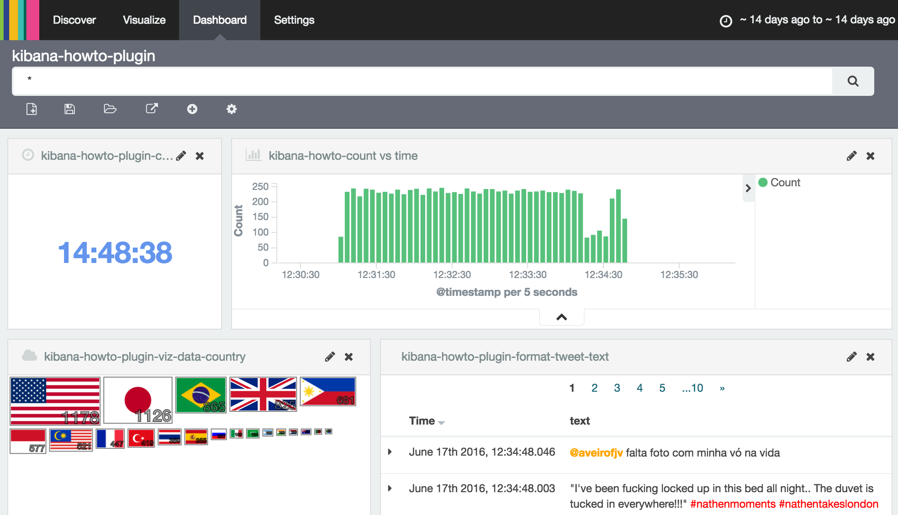
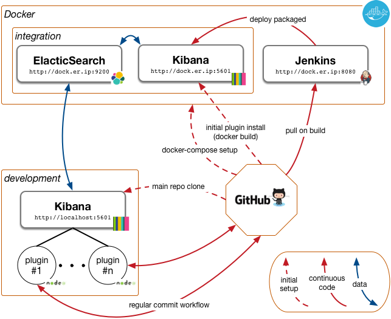

# A Journey in Writing & Deploying Kibana Plugins (riding Docker)

---
*The possibility of a custom plugin is a strong Kibana promise.
We propose an end to end tutorial to write such plugins.
But this "end to end" approach also means "how to continuously deploy them?", "how to share an environment with seeded data?"
Those questions will bring us in a full fledged integration infrastructure, backed by Docker.*

---

The ElasticSearch has grown from a Lucene evolution to a full fledged distributed dcoument store, with powerful storage, search and aggregation capabilities.
Kibana definiteley brought a strong component for interative searching and visualization and piped the data storage tier into an end user browser.

Customizable dashboards via a rich library of graphical components made its success, but soon, the need for real customization arose.
If plugins were thought to be integrated from early on, the actual customisation often lied into forking the master project and adapting to on particular purpose [REFREF daunting].
Merging back fixes was soon to be a daunting effort to keep up with the high pace of the [github evolution](https://github.com/elastic/kibana/graphs/contributors).

Fortunately, as of version 4.3, the Kibana project took a more structured way to integrate custom plugins.
The promise of maintainable external plugins was becoming true.
Those plugins, writen in JavaScript, can be as simple as a standalone widget (e.g. a clock), a field formater (an up/down arrow instead of positive/negative number), a graphical representation of a search result (a chart) or a full blown application.

So, that should be easy. Just google and you would craft wonderful shiny visualizations.

But not fast, young Kibana Padavan!
Documentation lacks, resources are valuable but scarce.
But the promise is still shiny and we want to reach it.

In this post, we propose to share our journey into the writing of Kibana plugins, the little pitfalls we fell in and the setup of continuous deployment into a Docker environment.
There is no dramatic discovery or stunning breakthrough today, but a tentative to write a map to make your journey easier.

-----------------

## The purpose of the Quest
The goals was to meet the Kibana 4.3+ promise, to be able to customize the platform without forking the orignal code branch.

Our *Definition of Done* was:

 * we should develop different plugin types: independant widget, formatters, aggregation visualization. Hints: at this stage, they don't need to be pretty or even particularly meaningful;
 * they should be resizable and offer the classic comfort of the Kibana experience; 
 * we should be able to build and deploy them via Jenkins or such;
 * we want to use Docker to run Jenkins, ElasticSearch, an integration Kibana;
 * with Docker, we want the infrastructure to start with preloaded data and visualization, to let user driven or automated test to happen;
 * we want the plugin development itself to be as smooth as possible (reload time when source code has changed);
 * we want others to be able to reproduce the experience;
 * finally, we want to be able to give a feedback on which extent the technology is mature for a full blown project.
 

*Figure 1:* ElasticSearch is fed with 10'000 geolocalized tweets. We display a snapshop of the deployed dashboard with custom plugins. From upper left to lower right:
a) a simple clock, untied to any data;
b) the default Kibana date histogram to allow for time range narrowing;
c) an aggregation visualization, where tweets are counted per country;
d) a search results with a custom formatter, altering the color for #hashtags and @accounts.
 
### Wasn't there any full detailed map available?
If only there had been one, this whole effort would have been a straight tweet: *"amazing tutorial on how to build and deploy #kibana plugins #elasticsearch http://wonder.land/build/your/own/kibana/plugins."*
Obviously, there none was found.
 
However, there were instructive and inspiring sources of information.
Although there might have been incomplete, slightly out of date or simply at a too high level, we cannot thank enough their authors for having put us on track.
 
 * Enlightening talks from the ElastiCon conferences in San Francisco, [2015](https://www.elastic.co/elasticon/2015/sf/contributors-guide-to-the-kibana-galaxy) and [2016](https://www.elastic.co/elasticon/conf/2016/sf/how-to-build-your-own-kibana-plugins). Way more blasting presentations are available there!
 * The most comprehensive piece of documentation at the time and ubiquituously cited, [a four parts post by Tim Roe](https://www.timroes.de/2015/12/02/writing-kibana-4-plugins-basics/). Although pretty descriptive, some information was missing, the commited code not fully working straightforwards (Kibana version?).

## The Journey log book

For the impatient, head to git (https://github.com/alexmasselot/kibana-plugin-howto-infra) and follow the instructions and have it running on your laptop.

### The architecture
To fullfill our quest, we need at least:

  * github to hold the plugins source code;
  * a local development Kibana server, where plugins are refreshed upon saved;
  * an ElasticSearch server, to store test data, and Kibana configurations;
  * an integration Kibana, where packaged plugins are deploye canonically;
  * Jenkins for continuous integration, to pull plugin source code from github, packaged those plugins and deploy them on the integration Kibana server.

For the sake of isolating an integration environment, we propose in figure 2  a Docker container set with Jenkins, ElasticSearch and the integration Kibana, while the development Kibana instance runs locally.
This is of course only an example setup, we won't claim by far it is thebest, but we believe it is sufficient to make our point.

We will now walk through this architecture, see how to deploy it and how the initial data (a list of tweets) and configuration (Kibana and Jenkins) are seed.

### Docker infrastructure

---
In this part, we will review how to launch a set of containers with the aformenentioned services.
If this part is rather classic, we will also see how we have populated each service with initial data, to offer the experience of an infrastructure *ready to go*.

---

Docker is a powerful container platform to encapsulate lightweight containers.
Perfectly suited for development, one can easily build upon pre-existing images (e.g. a *Kibana v4.5.1*), then custom them via `DockerFile` (e.g. tuning configuration).
(`docker-compose`)[QQQ] push the system even further, as it allows to generate a full set of containers with a private network, while some ports and volume are exposed to the outside world.
In the age of micro services and multi tenant architectures, we believe that lightweight container systems have deeply altered the developper's life.
The project presented here is a typical example of such architectures.

#### Spawning the infrastructure
First install Docker locally, see Docker documentation for instructions (https://docs.docker.com/engine/installation/).

To setup the continuous deployment environment for Kibana plugins development, clone the current repository:

	git clone https://github.com/alexmasselot/kibana-plugin-howto-infra.git
	cd kibana-plugin-howto-infra

The configuration for Elasticsearch, Kibana, Jenkins  is specified in `docker-compose.yml`

Now the Docker container can be started:

   export DOCKER_MACHINE_NAME=kibanahowto
	docker-machine create --driver=virtualbox --virtualbox-memory 4096 --virtualbox-cpu-count 2 --virtualbox-host-dns-resolver $DOCKER_MACHINE_NAME
	eval $(docker-machine env $DOCKER_MACHINE_NAME)
	docker-compose build
	echo "now start the machine and, when it's ready, open http://$(docker-machine ip $DOCKER_MACHINE_NAME):5601/app/kibana#/dashboard/kibana-howto-plugin?_g=(time:(from:'2016-06-17T10:30:12.574Z',mode:quick,to:'2016-06-17T10:36:14.545Z'))"
	docker-compose up

#### What have you just done???

You have deployed an Elasticsearch server, a Kibana and a Jenkins servers for continuous deployment.
Demo data is populated in Elasticsearch and a visualization is available in Kibana through default dashboard.

To access the servers in the container, you can find the IP address of the docker-machine with the following command:

	docker-machine ip $DOCKER_MACHINE_NAME

The different services are accessible here:

 * http://my_docker_ip:9200 for ElasticSearch server
 * http://my_docker_ip:5601 for a Kibana, or for a direct dashboard access:  http://my_docker_ip:5601/app/kibana#/dashboard/kibana-howto-plugin?_g=(time:(from:'2016-06-17T10:30:12.574Z',mode:quick,to:'2016-06-17T10:36:14.545Z'))
 * http://my_docker_ip:8080 for Jenkins continuous integration & deployment

Allow a couple minutes for the data to warm up.
You have setup the environment for continuous deployment of Kibana plugins.

####Populating initial data and configuration
One of our goal is to boot containers with preloaded data and configurations.

 * ElasticSearch contains 10'000 tweets with geographic coordinates.
 * Kibana is available with default dashboard, searches, visualizations and plugins.
 * Jenkins shows jobs ready to be ran. For each plugin, source code is pulled from github repository, packaged and deployed to the Kibana server via ssh.

We believe that only the seamless integrations process have a chance of being adopted by fellow developpers.
Remember Larry Wall (Programming Perl, 2nd edition, 1996), laziness, together with impatience and hubris, is one of the three virtues of a good developer.

As mentionned earlier, the overall infrastructure is described in the `docker-compose.yml` file, while individual containers are instanciated via `docker-containers/*/DockerFile`.
All the information can be found on the [Docker compose](https://docs.docker.com/compose/) page.

The only original part is on how we actually capture and populate the initial data

##### ElasticSearch (the tweets)
As mentionned before, we want to populated 10'000 geolocalized tweets, to demo our plugins.

###### Creating the set
A set is already available in the `containers/elasticsearch-initial-data/data/tweets.jsonl` file.
To create such a set, a `tweet-download.js` NodeJS script is avialable. It will simply register to a tweet stream of geolocalized micromessages and append them in a file.
Edit and source a `secret-env.sh` file with your API keys.
Refer to the [API](https://www.npmjs.com/package/twitter) to know more

###### Uploading the set in the ElasticSearch service
The `containers/elasticsearch-initial-data/entrypoint.js` contains call to the ElasticSearch npm [API](https://www.npmjs.com/package/elasticsearch).

The only pitfall to avoid was to wait for the ES server to be up, and only populate the tweets, at start time, only if they are not already in.
The ES container can be started several times and we obviously want to push the data only once.

##### Kibana
The first step is to install an initial version of ech of the three plugins.
As those are not yet available through our continuous integration component, we cheat and install them directly from github via the `containers/kibana/.entrypoint.sh`

The second step is to set `tweets` as default the index, create the demo searches, visualisations and dashboard.
This is done populating ElasticSearch indexes from *a priori* saved data, and is actually acchieved by the ES data instanciation step.

But there still is an egg and chicken problem: we needed to create a dashboard, in order to save it, in order to redownload it.
Sure.
Initial configurations had to be build at once by hand, and scipt to save them are avaialable in `containers/elasticsearch-initial-data/dump/kibana-download.js`

##### Jenkins
Being file based until version 2, Jenkins configuration consists in deploying a snapshot. Another chicken and egg problem.

Deploying the configuration is achieved by mounting the `/var/jenkins_home` directory in Docker from the github directory `docker-containers/jenkins/data/jenkins_home`.
Then, the Jenkins itself can be configured, jobs added, plugins installed through the classic web interface as the change are persisted in `/var/jenkins_home`, thus in the git repository.

The key point is to avoid polluting the repository with thousands of transient files (job runs, log, etc.)
We can generously exclude all of them in  the `.gitignore`.

## Writing custom plugins
At last, we talk about plugins!
Sorry for the impatient, but we had to set an infrastructure up first.

We built three plugins above our tweet data, strongly inspired (when not shamelessly forked) by the four part [blog post](https://www.timroes.de/2015/12/02/writing-kibana-4-plugins-basics/) by Tim Roes (see figure 1):

 1. a clock ([github](https://github.com/alexmasselot/kibana-howto-plugin-clock)), simply forked out from Tim's, except for the the packaging mechanism (in `package.json`) leveraged with the other plugins;
 2. a string field formatter ([github](https://github.com/alexmasselot/kibana-howto-plugin-format-tweet-text)), which turns #hastags and @accounts in different colors;
 3. a search result graphic visualization ([github](https://github.com/alexmasselot/kibana-howto-plugin-viz-data-country)), where the filtered tweets are count by country, and a flag display with a relative size. This view certainly is more evolved than the previous, using AngularJS and d3.js.

As there is nothing particularly compared to othere resources available, we won't dive into details.
We will only point out some implementation hints below that we found either lacing or unclear.

### The development process
 
The good part about customizable plugins is that one should be able to... customize them. Preferrably smoothly.
 
One solution is to:
 
 1. modify the code;
 2. push modified code to github;
 3. launch a Jenkins job to pull/package/distribute it;
 4. head to the Docker Kibana server to see the changes.

This easily take a couple of minutes, which is not smooth, by the XXIth century JavaScript standard.

The other solutions is to work locally (on the developper laptop):

 1. install at once Kibana and launch it in development mode;
 2. fork or clone at once the plugin source code into the `installedPlugins/` directory;
 3. modify the code;
 4. refresh the local browser;
 5. only push the code to github when a meangful step has been achieved.

The 3-4 feedback loop is way faster than the first method (even though refreshing the browser can take up to ten seconds.)

### A few hints
Tim Roes and others have explained in great details the nuts and bolts of writing plugins.
However, some information was not readily available to bypass the `hello world` step.

#### Resizable components
It seems abovious that components rendering should often adapt to their size.
This is even more true with Kibana customizable dashboard.

The common underlying library to build visualizaiton components is the verstatile AngularJS.
[Watcher](QQQ) mechanism allow to regularly watch the widget dimension and redraw when needed. QQQQ ref
Even though this solution is often proposed, it only partially works.
When moving around and resizing a full dashboard, the watcher function can be called too many times simultaneously, leading to exception generations.
Beside bein a poor prgogramming pattern, the user experience can be impacted.

An more elegant solution is to listen to some `resized` event, but little information was available.
The solution can from diving into Kibana source code and locate the 'change:vis' event.

Then, the implementation comes to (if `render`is the actual component rendering function):

    rootScope.$on('change:vis', render);
    
#### You said "AngularJS"?

Basing plugin code on AgularJS ceratinly is a maturity promise and one could be attracted by recycling prior knowledge on the framework.

If it can be seen sometimes as an inconvenient, AngularJS is opinionated, splitting an application into functional modules, organized in controllers, factories, services and directives.
Above this architecture, its success is certainly correlated to a versatile  ecosystem and the easiness, for example, to isolate components and write tests.

Unfortunately, most of the popular examples we found on Kibana plugins do not take advantage of the proposed split of concerns and add too much functionalities (such as rendering) into the controller.

However, nothing seems to intrisically make a proper AngularJS decoupling impossible.
Our conclusions are only based on this experience, where we may have left the battle too early.

#### Packaging a plugin
Packaging a plugin consisting in building the deployed `.zip` archive.
Athough several methods are proposed by various authors.

We converged towards the `@elastic/plugin-helpers` module, allowing `npm run build`. Once the zip archive is packaged, it can either be made available on a url (Jenkins published artefacts) or copied to the kibana server.

The plugin deployment itself is achieved by sshing onto the server and xecuting a `/opt/kibana/bin/kibana plugin --install ...`

To have more specifics about those command, the easiest way is to head to Jenkins an open the configuration of one of the `kibana-plugin-*-deploy`jobs.

##So, shall we use customizable Kibana plugins?
Or *"shall we write an independant classic rich web application, backed to a REST API on top of ES?"
The short answer is: "yes and no."

The ElasticSearch+Kibana stack certainly deserves its success.
And a huge part of it is due to the versatility of Kibana visulization, with basic and community plugins already availability.

Pushing the dashboard further on seems natural.
And then, turning the default exploration tools into an open production frontend seems an appealing and inexpensive solution, compared to writing a full rich web client from scratch.

This choice can make sense up to a certain limit.
Customization comes to often understimated costs:

 * the major one is the Elastic velocity. It goes fast, and architectural changes (minor or major) are often not backwards compatible. Kibana 3 & ES 1.7 have been adopted at large and the pace of changes is hard to follow for developpers. And Elastic 5 coming down the corner will keep us rocking for sure.
 * As a corollary to the previous point, if the stack is not mature, resources are scarce and answers often diverging.
 * The plugin development itself, even as presented in this artice is not radically smooth. In development mode, the lead time for a minor change (*"just this css width"*) to reach the screen takes a few (easily up to ten) seconds and make the process cumbersome to today standards, when we are more use to have screen refreshed in less than a second.
 * Tying up a whole project architecture to the Elastic perspective can make sense if we are ready to follow all their choice and willing to pay extraordinary prices for cusomtization (stepping sideways for authentification, for example)

Those costs taken into account, it may often not seem totally unreasonnable to head to an independant frontend development, backed by classic stack such as AngularJS, or even better for the topic at end, ReactJS + flux.

 	